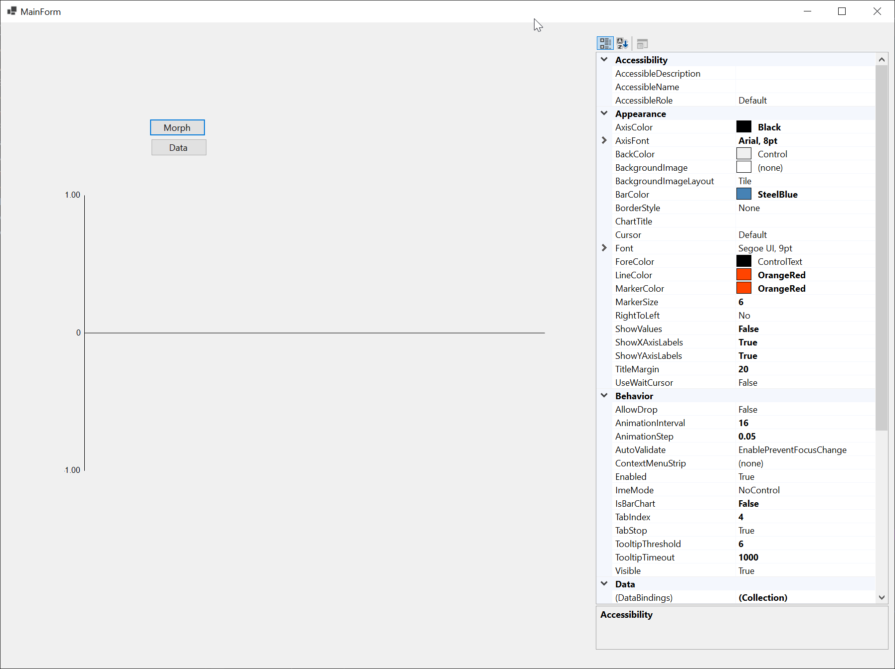

# VizMorph



### Features
- **High-Performance Streaming**:
  - Async data methods with thread-safe buffers
  - FIFO trimming (configurable MaxDataPoints)
  - Double-buffered painting
- **Advanced Statistics**:
  - Real-time min/max/avg/median calculations
  - Quartiles, IQR, and coefficient of variation
  - Configurable status bar overlay
- **Alert System**:
  - Threshold line with dash styling
  - `ThresholdReached` event with value payload
  - Hysteresis system to prevent event spamming
- **Customization**:
  - DPI-aware point sizing
  - Smooth line rendering (Catmull-Rom)
  - Companion controller UI for design-time setup
 
### Quick Start

```csharp
// Initialize with sample data
var graph = new SparklineGraph();
await graph.AddDataPointAsync(42.5f);

// Configure alerts
graph.ThresholdValue = 40;
graph.ThresholdReached += (s, val) => 
    MessageBox.Show($"Threshold breached: {val}");

// Enable features
graph.ShowStatistics = true;
graph.SmoothLines = true;
graph.MaxDataPoints = 100;

// Use controller UI
var controller = new SparklineGraphController();
controller.SelectedGraph = graph;
```

### Integration Tips
- Controller UI: Drag SparklineGraphController onto forms for live editing
- High-Frequency Data: Use UpdateDataAsync for batch updates
- Styling: Set LineColor/GridColor for theme matching
- Thresholds: Set ThresholdValue to float.NaN to disable
